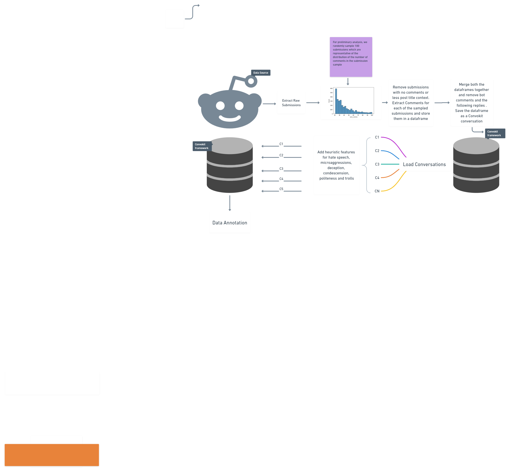

# nlu-data-preprocessing

## Aim 
Assess the cumulative effect of social discourse tasks (hate speech, 
microaggressions, trolls and others) in an online environment

## Motivation
1. A cumulative effect of different social problems such as hate speech, deception, condescension, trolls, politeness, and others in conversations have an overall intended effect on a person’s psyche, rather than any individual problem. 
2. The effect can have positive or negative consequences for a conversation participant or reader,  depending upon the interaction patterns observed among 
these tasks. For eg., polite conversations can conjure positive ideas, whereas conversations interspersed with hate and negative trolling can lead to
the development of misleading, and possibly, negative ideas. 
3. Hence, this project is an attempt at deciphering the latent patterns among the social patterns, which in turn would help us in a better estimation of the overall effect 

## Setup 
Coming Soon 

## Data Preprocessing Flow - Current Status 
. You can also link the preprocessing flow [here](https://whimsical.com/reddit-VToZqaZcpuY7hjbybd1bnb). 
